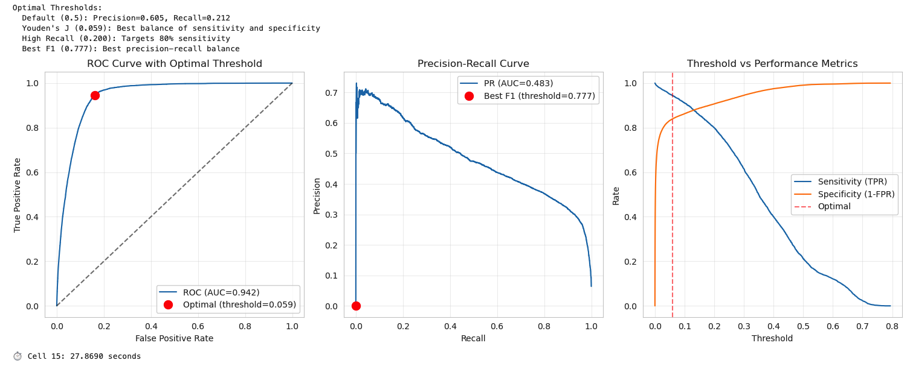
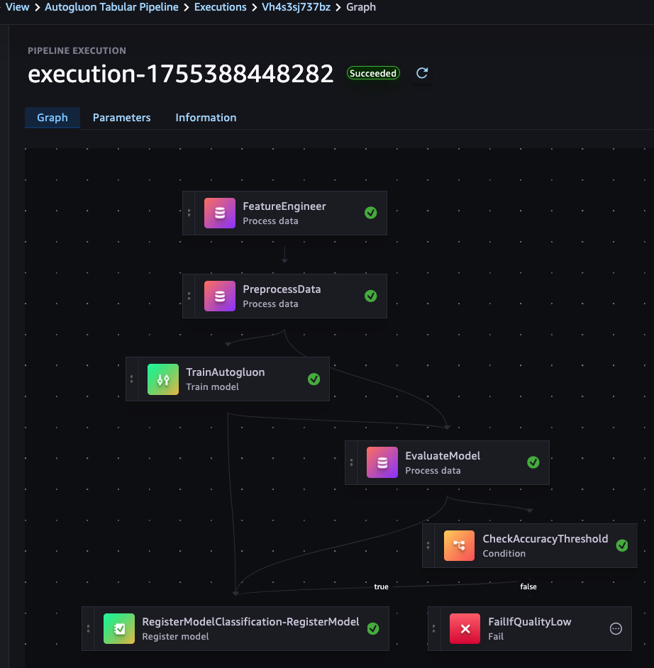

# COVID‑19 Mortality Prediction

> Educational, end‑to‑end project exploring early mortality‑risk prediction for patients presenting with COVID‑19 symptoms, from EDA to model training, validation, and (optional) SageMaker inference.

> **Disclaimer (non‑clinical use):** This repository is for learning and discussion only. It is **not** a medical device and must **not** be used to make clinical decisions.

---

## 1) Project Overview

During COVID‑19 surges, triage decisions had to be made quickly with limited information. This project studies whether standard tabular ML methods can help identify patients at higher mortality risk **at the first point of assessment**, complementing clinical judgment. It uses a public, de‑identified dataset and emphasizes transparency, calibration, and clear limitations.

---

## 2) Problem Statement

- **Task:** Supervised **binary classification** to predict in‑hospital mortality for a patient encounter.
- **Inputs:** Demographics and pre‑existing conditions; presentation dates; and other pre‑admission flags provided by the dataset (triage‑time features only—no post‑escalation leakage).
- **Output:** A predicted probability of death plus a class label given a decision threshold.
- **Success (educational):** Improve PR‑AUC over a regularized logistic‑regression baseline and improve calibration (Brier score), while optimizing recall at a fixed minimum precision.

---

## 3) Data

- **Source:** Kaggle — *COVID‑19 Patient Precondition Dataset* by **tanmoyx**.  
  (Place the CSV under `./data/` or update paths in the notebook/pipeline.)
- **Scope & caveats:** Real‑world surveillance data (country/time‑period specific) can contain missingness, coding differences, and drift; generalizability is limited and must be discussed explicitly.
- **Splits:** Stratified train/validation/test (e.g., 70/15/15) with a final held‑out test set for reporting.

---

## 4) Metrics

Because the positive class (death) is a minority, **PR‑AUC (average precision)** is the primary metric. We also report **ROC‑AUC**, **Recall (Sensitivity)**, **Specificity**, **Precision**, **F1**, and the **Confusion Matrix** at (i) the F1‑optimal threshold and (ii) a recall‑oriented threshold that respects a minimum precision. **Calibration** is assessed via **Brier score** and reliability curves; isotonic/Platt scaling may be applied post‑hoc.

---

## 5) Methods & Techniques

- **Baselines:**  
  1) **Majority‑class** (“always survive”).  
  2) **Regularized Logistic Regression** with class weighting on triage‑time features (interpretable first‑order benchmark).
- **Modeling:** **AutoGluon Tabular** with ensembling/stacking; time‑capped HPO.
- **Validation:** Stratified splits; metric suite above; bootstrap CIs on key metrics for the held‑out test set.
- **Explainability & fairness:** Global SHAP summaries; subgroup analysis by sex/age.
- **Leakage checks:** Exclude any post‑escalation features (e.g., intubation/ICU).
- **Calibration:** Reliability curves; optional isotonic/Platt scaling. 

---

## 6) Repository Structure

.
├── data/                          # local data (not tracked)
├── images/                        # generated plots/figures (incl. pipeline_dag.png)
├── pipeline/                      # SageMaker Pipelines code (definition & steps)
├── COVID-19-Mortality-Prediction.ipynb   # EDA + local training + evaluation
├── inference.py                   # local/remote inference helper
├── feature_columns.txt            # expected feature order/selection
├── endpoint_name.txt              # optional: SageMaker endpoint name
├── requirements.txt               # Python dependencies
├── proposal.pdf                   # project proposal (see summary below)
├── LICENSE                        # MIT license
└── README.md                      # this file

---

## 7) Quickstart

### Prerequisites
- **Python:** 3.10+ recommended
- **Install:** `pip install -r requirements.txt`
- **Data:** Download the Kaggle dataset and place the CSV under `./data/`.

### Choose a Training Path (I used both)

> I trained the model in **two different ways**, and you can reproduce either path below.

**A) Local — Jupyter Notebook (`COVID-19-Mortality-Prediction.ipynb`)**  
1. Open the notebook.  
2. Run cells for schema checks, missingness, **label derivation**, and leakage audit.  
3. Generate stratified splits and train baselines + AutoGluon ensemble.  
4. Plot PR/ROC curves and reliability (calibration).  
5. Save artifacts (feature list, model, plots) to `./images/` and project root.

**B) Managed — SageMaker Pipeline (`pipeline/` folder)**  
1. Review/edit parameters in the pipeline code under `./pipeline/` (S3 paths, instance types, time limits, gates, etc.).  
2. Create the pipeline and start an execution (standard SageMaker Pipelines workflow).  
3. The pipeline performs processing → training (AutoGluon) → evaluation → **(optional) model registration** based on gates.  
4. Results and evaluation artifacts are written to S3; copy plots/metrics locally as needed. 

**SageMaker Pipeline DAG**

> The DAG above reflects the steps defined in the `pipeline/` code for data processing, training, evaluation, and (optional) model registration. 

---

## 8) Results & Validation (How to Read)

- **Model report:** Focus on **PR‑AUC** improvements over logistic regression; check recall at a fixed minimum precision; review calibration curves.
- **Fairness & error analysis:** Inspect subgroup metrics (sex/age). Review high‑probability false positives/negatives for data issues or systematic errors.
- **Reproducibility:** Seeds fixed when supported; pinned packages; versioned artifacts. 

> Tip: Keep the final **held‑out test** metrics and plots in the repo under `images/` and call them out here.

---

## 9) Ethical Use, Limitations, and Risks

- **Non‑clinical:** Educational project only; dataset scope may not generalize; predictions can be biased by missingness, coding conventions, or drift.
- **Fairness:** Always inspect subgroup performance; consider threshold adjustments or re‑sampling when appropriate.
- **Transparency:** Prefer interpretable benchmarks and post‑hoc explanations before any real‑world consideration. 

---

## 10) Rubric Alignment (for Reviewers)

This README and the accompanying notebook are structured to meet the **Project (Final) Rubric**; the proposal and design choices map to the **Proposal Rubric** and **Proposal Instructions**. 

| Rubric Area | Where to Find It |
|---|---|
| **Project Overview** | §1 (overview in lay terms) 
| **Problem Statement** | §2 (clearly defined task, inputs/outputs, success criteria) 
| **Metrics** | §4 (primary/secondary metrics + justification) 
| **Data Exploration** | Notebook cells: schema, missingness, class balance, leakage checks 
| **Exploratory Visualization** | Notebook plots: distributions, PR/ROC, calibration (images/) 
| **Algorithms & Techniques** | §5 (baselines, AutoGluon, calibration, SHAP) 
| **Benchmark** | §5 (majority + logistic regression) 
| **Data Preprocessing** | Notebook/pipeline steps for encoding, date parsing, engineered intervals 
| **Implementation** | §7 (two training paths) + notebook + pipeline code 
| **Refinement** | HPO/ensembling + threshold tuning + calibration in notebook/pipeline 

_Proposal context:_ domain background, design, and pipeline choices are summarized in §11 and elaborated in `proposal.pdf`. 

---

## 11) Proposal Summary (one‑page recap)

- **Domain & motivation:** Early risk stratification can help allocate scarce resources; project explores the idea with public data and strict caveats.
- **Dataset & inputs:** Kaggle surveillance data with demographics/comorbidities and outcomes; derive label in code; quantify missingness/imbalance.
- **Solution:** Baselines + AutoGluon ensemble; calibration and fairness checks; clear reporting on PR‑AUC and recall.
- **Design:** EDA → feature processing → stratified splits → baselines → AutoGluon + HPO → validation/calibration → fairness/error analysis → (optional) packaging/endpoint.

---

## 12) How to Reproduce

1. Create a clean Python env and `pip install -r requirements.txt`.
2. Download the dataset to `./data/`.
3. **Pick a path:** run the **notebook** locally (Path A) _or_ the **SageMaker pipeline** (Path B).
4. Save metrics artifacts and plots to `./images/`.
5. (Optional) Deploy a model and test `inference.py` locally or against a SageMaker endpoint.

---

## 13) License

This project is released under the **MIT License** (see `LICENSE`).

---

## 14) Acknowledgments

- Kaggle dataset by **tanmoyx**.
- Udacity materials for the **Final Project Rubric** and **Proposal guidance**. 

